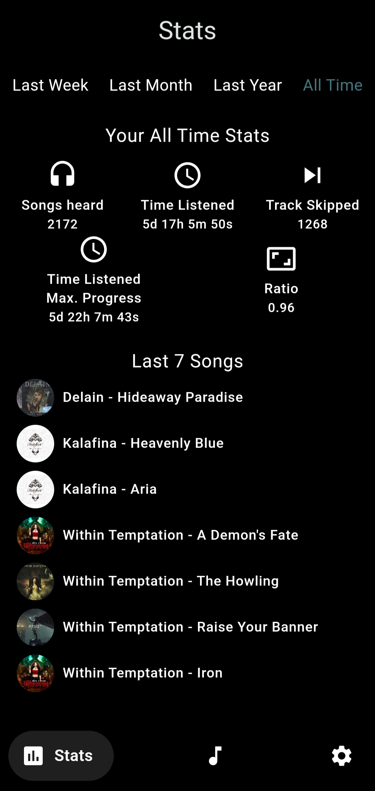
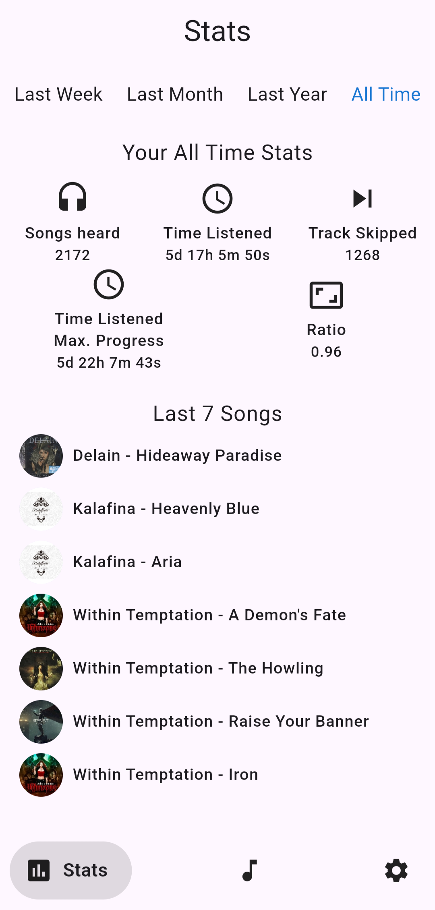
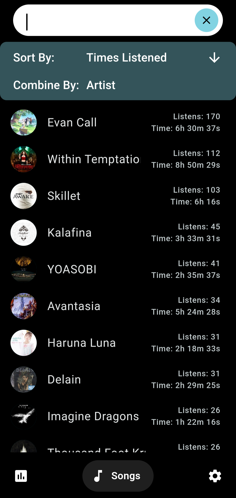

# Scrobblium

Scrobblium is a simple music tracking app. It “should” be able to track from any app that supports MediaSession and has a Token in its notification.
## Screenshots

<table>
  <tr>
    <td style="text-align: center;">
      
      <p>Start Page. White Mode</p>
    </td>
    <td style="text-align: center;">
      
      <p>Start Page. Dark Mode</p>
    </td>
    <td style="text-align: center;">
      
      <p>Songs Page. With Search</p>
    </td>
  </tr>
</table>

## Functions
- Tracks music from any app that supports MediaSessions
- Own small statistics in the app. (This app does not provide many statistics on its own. It is meant to be used with an integration like Maloja)
- Integrations (currently only [Maloja](https://github.com/krateng/maloja))
- Conditional upload for integrations to save battery
- Backup/import/export database
- Exporting a file for Maloja to import
- Generally almost no battery consumption. Own experience on a S20 with 4-5 hours of listening to music it used 0.5% battery. If the settings don't lie.
### Apps I tested
- [Namida](https://github.com/namidaco/namida)
- [Metro](https://github.com/MuntashirAkon/Metro)
- Spotify also works. Even track ads :)
## Build

1. **Install Flutter**: 
   If you haven't already, install Flutter. You can find detailed installation instructions on the [official Flutter website](https://flutter.dev/docs/get-started/install).

2. **Clone the Repository**: 
   Clone the Scrobblium repository to your local machine using Git:

   ```
   git clone https://github.com/ChikyuKido/Scrobblium.git
   ```

3. **Run the App**: 
   Navigate to the project directory and run the app on your Android device or emulator:

   ```
   cd Scrobblium
   flutter run
   ```
## Support

If you have any questions or encounter issues with Scrobblium, please feel free to reach out to us. You can [open an issue](https://github.com/yourusername/scrobblium/issues) on GitHub for assistance.

## License

This project is licensed under the GPL-3.0 License. See the [LICENSE](LICENSE) file for details.
